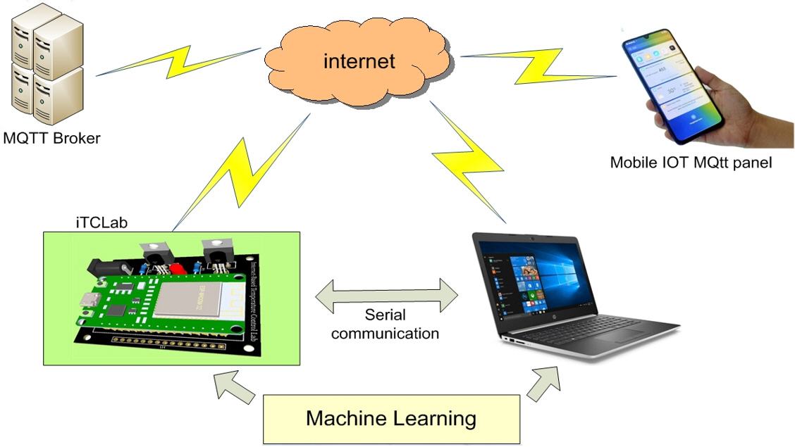

# iTCLab

iTCLab is an enhanced version of the TCLab developed by Prof. John Hedengren from Brigham Young University, further improved by Mr. Basuki Rakhmat from UPN "Veteran" Jawa Timur. 

## Key Features

- **Enhanced Communication:** iTCLab replaces the original microcontroller with an ESP32, enabling internet connectivity.
  
- **Expanded Functionality:** While retaining the core methods of TCLab, iTCLab extends its capabilities to include PID control, system control, AI integration, and more.
  
## Research Support

Numerous academic papers have utilized iTCLab for research purposes, including:

- [iTCLab Temperature Monitoring and Control System Based on PID and Internet of Things (IoT)](https://www.igi-global.com/chapter/itclab-temperature-monitoring-and-control-system-based-on-pid-and-internet-of-things-iot/319461)
- [On/Off Temperature Monitoring and Control via the Internet of Things Using iTCLab Kit](https://www.nstproceeding.com/index.php/nuscientech/article/view/931)
- [Temperature Monitoring via the Internet of Things Using PID-iTCLab](https://www.nstproceeding.com/index.php/nuscientech/article/view/939)

## How to Use

To utilize iTCLab for your own projects, follow the documentation and resources provided in the website. For further assistance, feel free to reach out to the developers or community for support.

## Contributions

Contributions to iTCLab are welcomed! If you have ideas for improvements or would like to report issues, please open an issue or reachout the contact person from the section below.

## Acknowledgements

We gratefully acknowledge the contributions of Prof. John Hedengren, Brigham Young University, and Mr. Basuki Rakhmat, UPN "Veteran" Jawa Timur, for their foundational work on TCLab and iTCLab.

## Contact

For inquiries or further information, please visit [this website](https://io-t.net/itclab/page/tentang_itclab)